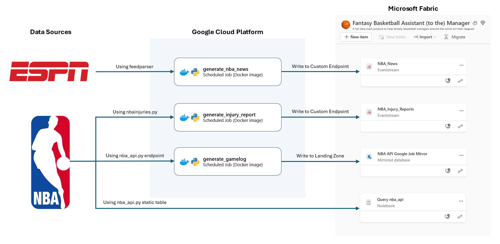
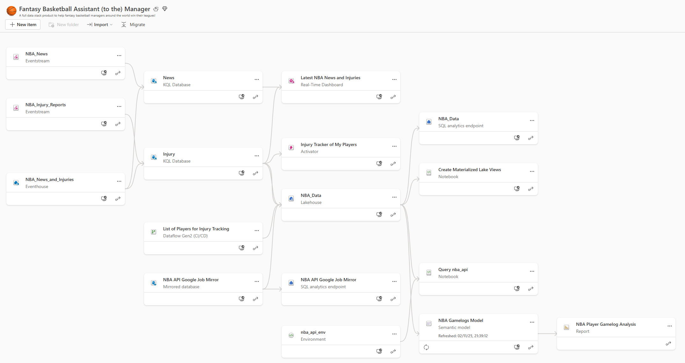
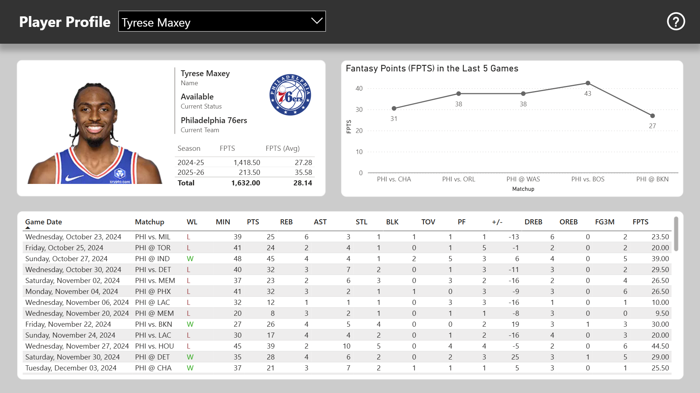
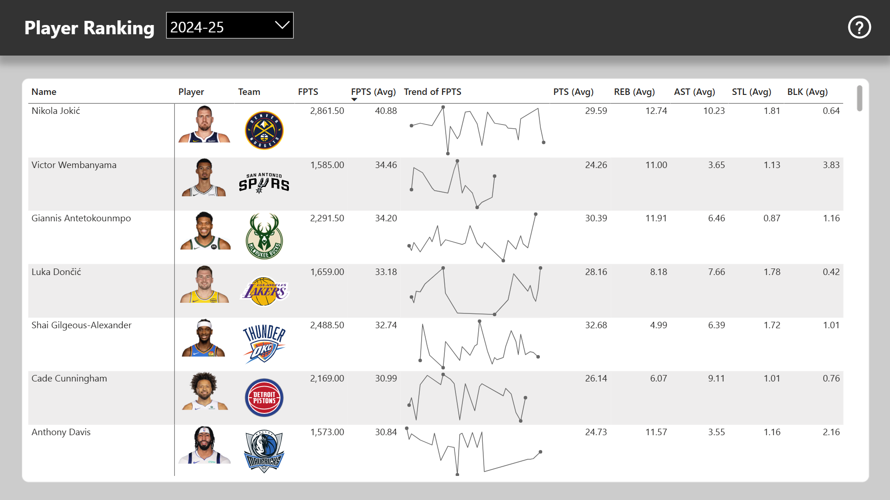
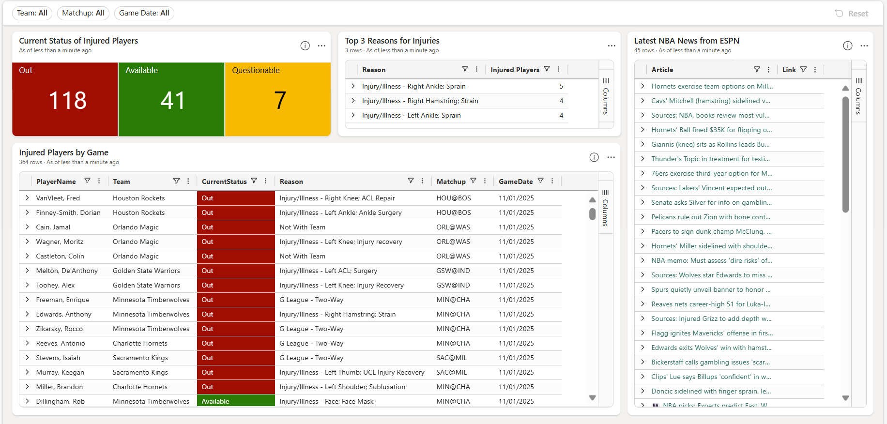
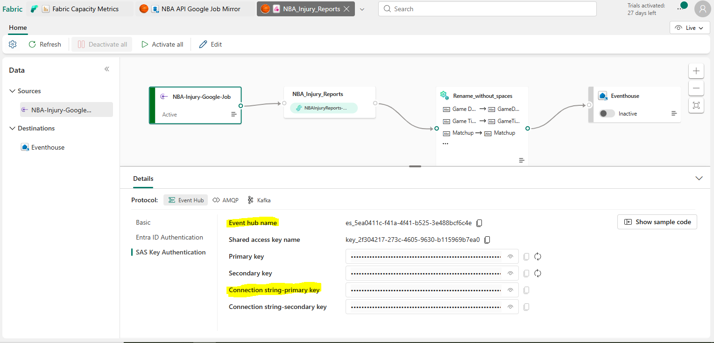
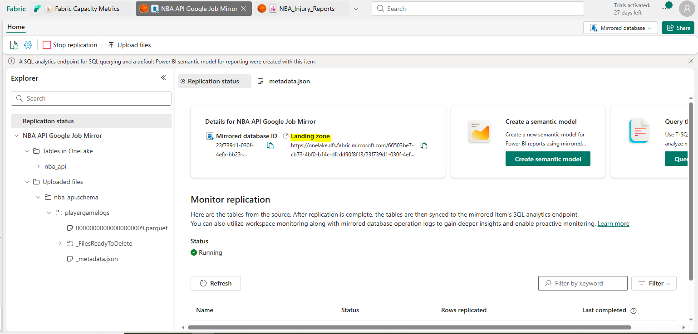
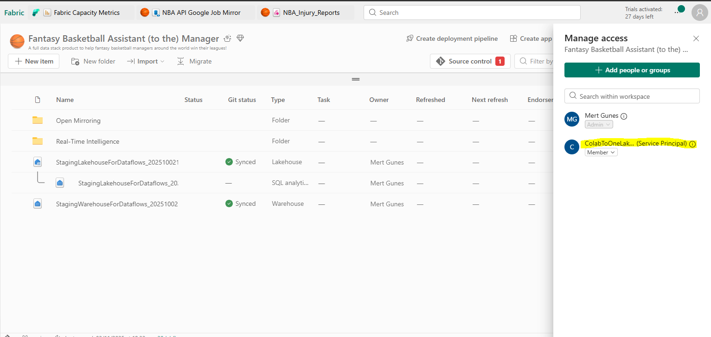
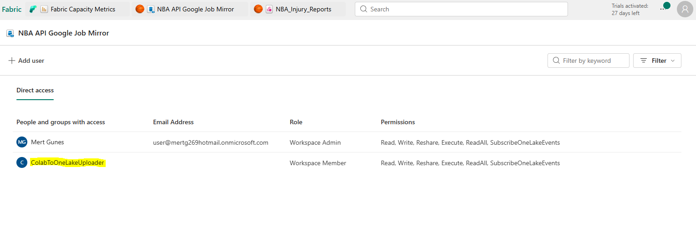
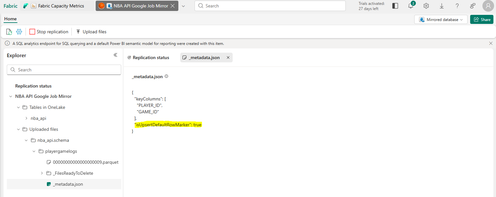

# Fantasy Basketball Assistant (to the) Manager
## 1. Background
The Fantasy Basketball Assistant (to the) Manager is a full-stack, minimum viable data product built to empower the millions of fantasy basketball managers around the globe. It delivers advanced analytics on boxstats and real-time data on NBA injury reports and ESPN news in a competition where timing and insight are everything.

Fantasy basketball is a game where players become virtual GMs, assembling rosters of real NBA players whose on-court performances directly impact fantasy outcomes. But most managers are stuck with the same surface-level stats offered by their platforms  i.e. data that is available to all competitors and therefore offers no strategic edge. What they need is an assistant manager (or an assistant to the manager — shoutout to Dwight Schrute from _The Office_) that can offer data-driven intelligence to guide key decisions ranging from draft day steals to mid-season trades. This data product is my attempt to fill in this analytics gap. It is also my submission to the Fabric Global Hackathon 2025.

## 2. Architecture Overview
The Fantasy Basketball Assistant (to the) Manager is built primarily on Microsoft Fabric, using data from NBA and ESPN, with Google Cloud Platform acting as an intermediary.

The most important dataset is player gamelogs which are queried from NBA using the open-source nba_api.py package. The challenge with using this package in a Fabric environment is that the IPs used by Fabric Notebooks—like most cloud platform IPs—are blocked by the NBA API and therefore calls to dynamic endpoints return a ReadTimeout error: HTTPSConnectionPool(host='stats.nba.com', port=443): Read timed out. (read timeout=30). Research on this topic with help from Copilot led me to use Google Cloud Platform that had whitelisted IPs. So I built a Google Job (run with Google Scheduler) that is a Docker image based on a Python script that queries the playergamelogs endpoint. To avoid the overhead of storing the query result in an intermediary storage and then having to run an ETL from Fabric, I opted to use the Open Mirroring Database feature on Fabric. This way, I am able to write the query result directly into a OneLake Landing Zone that are then automatically converted to managed delta tables in Fabric. Building on the Google Job for gamelogs, I also created Google Jobs to query data from ESPN and NBA injury reports, using parserfeed and nbainjuries.py respectively, and write them directly to a Custom Endpoint of Fabric Evenstream. These jobs can be run at a high frequency to simulate real-time data.

After the data lands to the Fabric workspace, there are multiple components (described in detail in the next section) that power:
- **NBA Player Gamelog Analysis:** a Power BI report that provides insights into each NBA player's stats and fantasy points with dynamic scoring settings. This provides an in-depth dive to each player's profile as well as a player ranking list that can be based on statistical metrics different to the default rankings of fantasy basketball platforms.

  
- **Latest NBA News and Injuries:** a Real-Time Dashboard that visualizes, in real-time, the injury status of players by game along with the latest ESPN news on the NBA. This helps fantasy basketball managers to decide their starting roster and stream 'injury-replacement' players by providing them the latest news in one place.

  
- **Injury Tracker of My Players:** an Activator with an alert that sends an email when one of the manager's players' injury status changes. This alert fantasy basketball managers to make roster changes in time for upcoming games.

## 3. Components
### 3.1. Google Jobs
#### 3.1.1. generate_gamelog
This is a collection of files that are used to create a Docker image on Google Cloud as a Job. The main python script queries the playergamelogs endpoint from the nba_api.py package and writes it into Fabric Open Mirror Database's landing zone using the openmirroring_operations.py package. Note that the openmirroring_operations.py is not available to be installed from the public python library and is therefore loaded directly into the docker image instead of being listed in requirements.txt. The python script also has an optional script to create a table in the landing zone in case of the first time. This can be invoked by passing 1 to the optional variable "CREATE_TABLE" when running the Google Job. The created table has the argument key_cols = ["PLAYER_ID", "GAME_ID"] which are crucial for implementing an incremental refresh.
#### 3.1.2. generate_injury_report
This is a collection of files that are used to create a Docker image on Google Cloud as a Job. The main python script queries injury reports using the nbainjuries.py package and writes it into a Custom Endpoint created within a Fabric Evenstream. The query takes a timestamp as an argument in order to return the injury reports as a snapshot. I noticed that the latest snapshots available are based on the GMT-4 or GMT-5 timezone, so I conservatively call the snapshot from GMT-5 timezone to simulate real-time data.
#### 3.1.3. generate_nba_news
This is a collection of files that are used to create a Docker image on Google Cloud as a Job. The main python script simple queries the latest list of ESPN articles using the parserfeed package and writes it into a Custom Endpoint created within a Fabric Evenstream.
### 3.2. Fabric
#### 3.2.1. Open Mirroring
##### 3.2.1.1. Create Materialized Lake Views.Notebook
This notebook is used to create Materialized Lake Views (MLV) within the NBA_Data lakehouse. The lakehouse obtains data from multiple sources including a couple of shortcuts, so MLVs are useful in creating a 'gold layer' of tables under the semantic schema that can then be used to build a star-schema semantic model for a Power BI report. By later scheduling a daily refresh of the MLVs, I am able to achieve multi-table atomicity. The notebook itself is relatively straightforward with a collection of SQL scripts to create MLVs. 
##### 3.2.1.2. NBA API Google Job Mirror.MirroredDatabase
This is the key artifact used to create a Landing Zone where the results from the nba_api playerlogs endpoint are directly written, in parquet format, by the generate_gamelog Google Jobs. The Fabric infrastructure then automatically creates and manages a delta table based on the written parquet files.
##### 3.2.1.3. NBA Gamelogs Model.SemanticModel
This is semantic model with a Direct Lake on OneLake connection to the tables under the semantic schema in the NBA_Data lakehouse. This semantic model hosts relationships betweeens these tables, measures and numeric parameters later used by the NBA Player Gamelog Analysis.Report
##### 3.2.1.4. NBA Player Gamelog Analysis.Report
This is a Power BI report that is based on the NBA Gamelogs Model.SemanticModel (as a thin file with no semantic model of its own). It consists of 3 pages. The first page provides an interface for users to control the fantasy scoring settings using numeric parameter sliders. The second page provides a deep-dive into any active NBA player's profile and fantasy performance. The third page provides a player ranking list with key metrics to compare players with.
##### 3.2.1.5. NBA_Data.Lakehouse
This is the center of the Open Mirroring architecture where there is a shortcut to the MirroredDatabase, a shortcut to one of the tables from the NBA_Injury_reports.Evenstream, additional tables loaded in using a dataflow and notebook, and finally a collection of materialized lake views that form the semantic tables.
##### 3.2.1.6. Query nba_api.Notebook
This is the Fabric notebook that loads the static tables of player and team dimensions into the NBA_Data lakehouse using the nba_api.py package. This notebook is also proof that any attempt to query the dynamic endpoints in nba_api.py will fail due to blocked IPs. 
##### 3.2.1.7. nba_api_env.Environment
This is simply an environment with the nba_api package added and is used by the Query nba_api.Notebook.
#### 3.2.2. Real-Time Intelligence
##### 3.2.2.1. Injury Tracker of My Players.Reflex
This is an Activator artifact that tracks the latest status of injury of players coming in from the NBA_Injury_Reports.Evenstream and alerts by email if any of the manager's players' injury status changes. The list of the manager's players is provided via manual input to the List of Players for Injury Tracking.Dataflow which writes the list into the NBA_Data lakehouse that in return has a shortcut into the NBA_News_and_Injuries.Eventhouse - here, a KQL query joins this list with the data from the evenstream.
##### 3.2.2.2. Latest NBA News and Injuries.KQLDashboard
This is a Real-Time Dashboard based on the real-time data streamed into the NBA_News_and_Injuries.Eventhouse. It provides an analysis of the injury reports as well as a list of the latest NBA news from ESPN with clickable links. 
##### 3.2.2.3. List of Players for Injury Tracking.Dataflow
This is the dataflow that allows managers to manually input the list of their players in order for the Injury Tracker of My Players.Reflex to send email alerts if any of these players' injury status changes.
##### 3.2.2.4. NBA_Injury_Reports.Evenstream
This is the evenstream that hosts a Custom Endpoint for the generate_injury_report Google Job to land the latest injury reports that are then loaded into the NBA_News_and_Injuries.Eventhouse.
##### 3.2.2.5. NBA_News.Evenstream
This is the evenstream that hosts a Custom Endpoint for the generate_nba_News Google Job to land the latest NBA news from ESPN that are then loaded into the NBA_News_and_Injuries.Eventhouse.
##### 3.2.2.6. NBA_News_and_Injuries.Eventhouse
This is the Eventhouse that hosts the real-time data being streamed from the NBA_News.Evenstream and NBA_Injury_Reports.Evenstream in the news and injuries databases respectively. This Eventhouse also has a shortcut to the list of players in the NBA_Data Lakehouse while also providing a shortcut to the latest status of injured players. This Eventhouse powers the Latest NBA News and Injuries KQL Dashboard as well as the Injury Tracker of My Players Activator.

## 4. Setup & Usage
### 4.1. Licenses and Accounts
This product was built using a Free Trial account on both Fabric and on Google Cloud platform.
### 4.2. Setup of Google Jobs
I created the Google Jobs of Docker images using the Google Cloud Shell. I uploaded / created the collection of files used for each Docker image into the temproary memory of the Google Cloud Shell editor before running the build command. After creating the Google Jobs, I configured them with variables and secrets, and then scheduled them using Google Cloud Scheduler:
- **generate_gamelog:** every day at 8 am CET
- **generate_injury_report:** every 5-30 minutes (depending on the capacity usage of Fabric)
- **generate_nba_news:** every 5-30 minutes (depending on the capacity usage of Fabric)

The jobs require input to some variables that connect them to the Fabric Open Mirror Landing zone or 1 of the 2 Fabric Evenstream. For the Fabric Evenstreams, the connection details that are passed to the FABRIC_EVENSTREAM_CONN_STR and FABRIC_EVENSTREAM_NAME job variables (via Google Secret manager) can be found in Fabric at:

As for the Open Mirror Landing Zone, the connection details for the landing zone that are passed to the FABRIC_HOST job variable (via Google Secret manager) can be found in Fabric at:

More importantly, there must also be a Service Principal that has access to both the workspace and the Open Mirror Database in Fabric (as shown in the snapshots below) that we can pass its details to the FABRIC_CLIENT_ID, FABRIC_TENANT_ID and FABRIC_CLIENT_SECRET job variables (via Google Secret manager).

### 4.3. Setup of Fabric Open Mirror
When first creating the table in the Open Mirroring database, I passed 1 to the optional variable "CREATE_TABLE" of the generate_gamelog Google Job. This created a table with the key_cols as defined in the script along with a json file. I then manually edited this json file, using OneLake explorer, to add the argument "isUpsertDefaultRowMarker": true as seen below. This is crucial in enabling my incremental refresh policy - I can now write additional parquet files into the same table location within the Open Mirror Landing zone and Fabric will treat each new row as UPSERT meaning that it will either replace the previous version of the row or create a new row if it doesn't already exist. This argument saves me from having to pass an additional __rowMarker__ column in my parquet files since I want to default to UPSERT anyway.

Having set this up, I first load in the full dataset of gamelogs from the previous season (2024-25) and then I set up the generate_gamelog job to run once a day every morning to load in the dataset of gamelogs from the current season (2025-26). This treats the current season as the partition that gets replaced with every run.

## 5. License
MIT License

